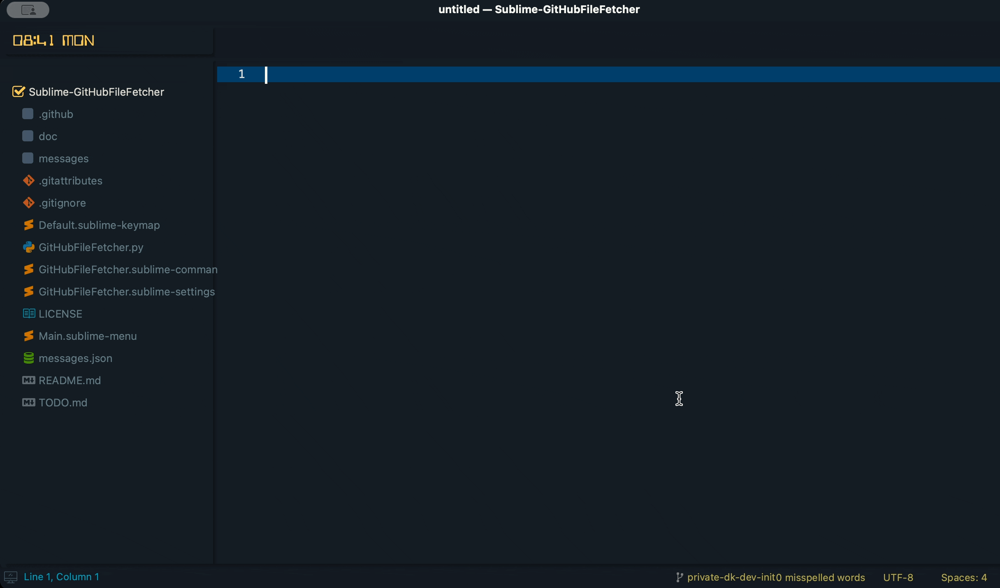

# GitHubFileFetcher

**GitHubFileFetcher** is a Sublime Text package that searches and fetches files from GitHub.

| Repository | GitHub | Sublime Text |
| ------ | ------ | ------ |
|  |   |  |
|  |   |  |
|   |  |  |
|   |  |  |

| Status |
| ------ |
| [](https://github.com/dennykorsukewitz/Sublime-GitHubFileFetcher/compare/1.0.0...dev)   |

## Feature

The following steps are performed one after the other.

**1. GitHubFileFetcher (1/6):** Fetching GitHub repositories.

    This function allows you to search for GitHub owners or GitHub repositories.
    The search results (owner/repository) are then displayed.

**2. GitHubFileFetcher (2/6):** Fetching branches.

    After selecting the repository, all possible branches are displayed.

**3. GitHubFileFetcher (3/6):** Fetching files.

    After that, select the desired file.

**4. GitHubFileFetcher (4/6):** Fetching destination folder.

    Finally, the destination folder must be selected.

**5. GitHubFileFetcher (5/6):** Enter or change destination file path...

    Enter or change destination file path.

**6. GitHubFileFetcher (6/6):** Added file.

    `Hocus Pocus` - The file was created at the desired location.

**GitHubFileFetcher:** Should I save the new repository in the settings?

    So that you don't have to search for the repositories again and again,
    you can save the currently used one in the settings.

**Command:**  ```GitHubFileFetcher: Searches and fetches files from GitHub.```



### Settings

`Preferences -> Settings -> Extensions -> GitHubFileFetcher`

| Name | Description | Default Value |
| - | - | - |
| information_messages | Information messages will be displayed. | true |
| github_username | GitHub username | dennykorsukewitz |
| github_token | GitHub token | 123xxx789 |
| repositories | List of possible GitHub repositories. GitHub {owner}/{repo}. | dennykorsukewitz/Sublime-GitHubFileFetcher |

The GitHub API is limited to 60 requests per hour for non authorized requests. You can provide your GitHub username and an access token to push this limit to 5000 requests per hour. Please see the [official GitHub doc](https://docs.github.com/en/free-pro-team@latest/rest/rate-limit/rate-limit?apiVersion=2022-11-28) for further information.
You can generate the access token in your [GitHub settings](https://github.com/settings/tokens).

---

## Installation

To install this package, you have **three** options:

### 1. Search Package via `Package Control`

Search and install online package via [Sublime Package Control](http://wbond.net/sublime_packages/package_control).

`Tools` -> `Command Palette` -> `Package Control: Install Package` -> simply search for `GitHubFileFetcher` to install.

### 2. Install via sublime-package file

Download latest [sublime-package file](https://github.com/dennykorsukewitz/Sublime-GitHubFileFetcher/releases) and move the package `GitHubFileFetcher.sublime-package` to `Installed Packages` folder.

#### OSX

    cd ~/Library/Application\ Support/Sublime\ Text\ 2/Installed Packages/
    - or ST 3 -
    cd ~/Library/Application\ Support/Sublime\ Text\ 3/Installed Packages/

#### Linux

    cd ~/.config/sublime-text-2/Installed Packages
    - or ST 3 -
    cd ~/.config/sublime-text-3/Installed Packages

#### Windows

    cd "%APPDATA%\Sublime Text 2\Installed Packages"
    - or ST 3 -
    cd "%APPDATA%\Sublime Text 3\Installed Packages"

### 3. Source code

Clone the latest [dev branch](https://github.com/dennykorsukewitz/Sublime-GitHubFileFetcher) and unpack it to Sublime Package folder `Packages`.

#### OSX

    cd ~/Library/Application\ Support/Sublime\ Text\ 2/Packages/
    - or ST 3 -
    cd ~/Library/Application\ Support/Sublime\ Text\ 3/Packages/
    git clone git@github.com:dennykorsukewitz/Sublime-GitHubFileFetcher.git GitHubFileFetcher

#### Linux

    cd ~/.config/sublime-text-2/Packages
    - or ST 3 -
    cd ~/.config/sublime-text-3/Packages
    git clone git@github.com:dennykorsukewitz/Sublime-GitHubFileFetcher.git GitHubFileFetcher

#### Windows

    cd "%APPDATA%\Sublime Text 2\Packages"
    - or ST 3 -
    cd "%APPDATA%\Sublime Text 3\Packages"
    git clone git@github.com:dennykorsukewitz/Sublime-GitHubFileFetcher.git GitHubFileFetcher

---

## Download

For download see [Sublime-GitHubFileFetcher](https://github.com/dennykorsukewitz/Sublime-GitHubFileFetcher/releases)

---

Enjoy!

Your [Denny Korsukéwitz](https://github.com/dennykorsukewitz) 🚀
